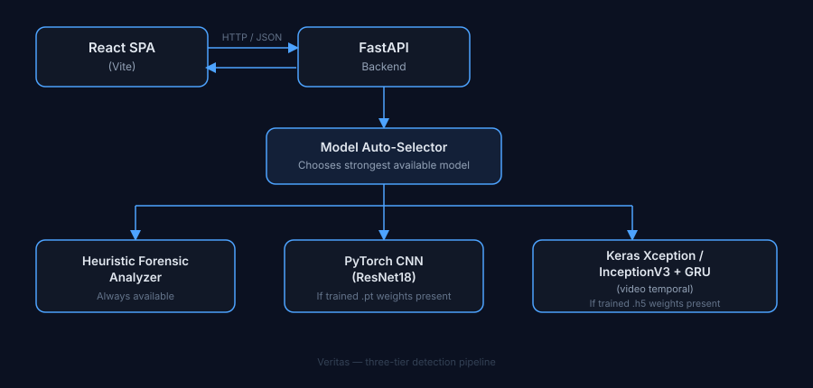

<h1 align="center">🛡️ VERITAS</h1> 
<p align="center"><b>Intelligent Deepfake Detection Platform</b></p>

## Overview
 
Veritas is a full-stack media authenticity analysis platform that detects manipulated images and videos using a three-tier inference pipeline combining forensic signal analysis, a PyTorch CNN, and  Keras-based Xception/InceptionV3+GRU models, delivering confidence scores and detailed forensic insights through an interactive React dashboard while gracefully falling back to heuristic analysis when trained model weights are unavailable.

## Architecture
 
<p align="center">  </p>
 
## Detection Pipeline
 
| Tier | Component | Trigger | Description |
|------|-----------|---------|--------------|
| 1 | Heuristic forensic analyzer | Always available | FFT frequency analysis, noise variance, edge sharpness, chroma consistency |
| 2 | PyTorch CNN (ResNet18) | `weights/` contains trained `.pt` | Transfer-learned binary classifier on cropped face regions |
| 3 | Keras Xception / InceptionV3+GRU | `weights/` contains trained `.h5` | Frame-level spatial features with GRU temporal aggregation for video |
 
At startup, `main.py` probes the `weights/` directory and selects the highest tier with valid weights present. Face regions are localized via Haar cascade prior to signal extraction or inference. For video, per-frame scores are aggregated with temporal variance to produce a single confidence score and a frame-by-frame timeline.
 
## Tech Stack
 
**Backend**
- Python, FastAPI, Uvicorn
- OpenCV, NumPy, Pillow
**Models**
- PyTorch (ResNet18)
- TensorFlow / Keras (Xception, InceptionV3 + GRU)
**Frontend**
- React, Vite
- Tailwind CSS
- Recharts
- Lucide Icons
**Dataset**
- Kaggle "140k Real and Fake Faces" (FFHQ real vs. GAN-generated fake)
## Project Structure
 
```
veritas/
├── backend/
│   ├── main.py                 FastAPI entrypoint; model auto-selection
│   ├── detector.py             Heuristic forensic analyzer
│   ├── cnn_inference.py        PyTorch CNN inference
│   ├── keras_inference.py      Keras Xception/GRU inference
│   ├── train.py
│   ├── train_image.py
│   ├── train_video.py
│   ├── train_image_csv.py
│   ├── evaluate.py             Precision / recall / F1 / ROC-AUC
│   ├── download_dataset.py     Kaggle dataset fetcher
│   ├── dataset_meta/           train.csv, valid.csv, test.csv
│   ├── weights/                Trained model artifacts
│   ├── requirements.txt
│   └── requirements-train.txt
├── frontend/
│   └── src/
│       ├── App.jsx
│       ├── assets/
│       │   └── veritas-icon.svg
│       ├── pages/              Home, Scan, History, About
│       └── components/         Navbar, Logo, Footer, UploadView, ResultView, SignalBars, ScanHistory
└── README.md
```
 
## Getting Started
 
### Prerequisites
 
- Python 3.10+
- Node.js 18+
- (Optional) CUDA-capable GPU for training
### Backend
 
```powershell
cd backend
python -m venv venv
venv\Scripts\activate
pip install -r requirements.txt
python main.py
```
 
The API starts on `http://localhost:8000` by default and logs which detection tier it selected on boot.
 
### Frontend
 
```powershell
cd frontend
npm install
npm run dev
```
 
The dashboard starts on `http://localhost:5173` and expects the backend at `http://localhost:8000`.
 
## Training
 
Training requires the full dataset and additional dependencies not needed for inference.
 
```powershell
pip install -r requirements-train.txt
 
python train_image_csv.py --images_root "D:\path\to\real-vs-fake" --out weights/xception_deepfake_image.h5
```
 
Trained weights placed in `backend/weights/` are picked up automatically on the next backend restart no configuration change required.
 
## Model Evaluation
 
```powershell
python evaluate.py --images_root "D:\path\to\real-vs-fake"
```
 
Outputs precision, recall, F1, and ROC-AUC against the held-out test split defined in `dataset_meta/test.csv`.
 
## API Reference
 
| Method | Endpoint | Description |
|--------|----------|--------------|
| `POST` | `/scan/image` | Upload an image, returns confidence score and forensic signal breakdown |
| `POST` | `/scan/video` | Upload a video, returns confidence score, signal breakdown, and per-frame timeline |
| `GET`  | `/status` | Returns backend health and which detection tier is currently active |
 
## Roadmap
 
- Grad-CAM heatmaps to localize manipulated regions
- Audio deepfake detection for video soundtracks
- Batch scanning for multiple files in a single request
- API key authentication and rate limiting
- Docker containerization and cloud deployment
- Face-swap boundary localization overlay
## Author
 
**Amit Dhotre**
Computer Engineering student, AI & Data Science.
 
